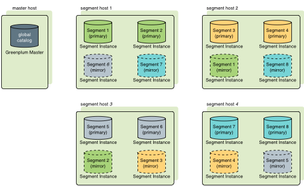

# Overview of Segment Mirroring
---

When WarehousePG High Availability is enabled, there are two types of segment instances: *primary* and *mirror*. Each primary segment has one corresponding mirror segment. A primary segment instance receives requests from the coordinator to make changes to the segment data and then replicates those changes to the corresponding mirror. If WarehousePG detects that a primary segment has failed or become unavailable, it changes the role of its mirror segment to primary segment and the role of the unavailable primary segment to mirror segment. Transactions in progress when the failure occurred roll back and must be restarted. The administrator must then recover the mirror segment, allow the mirror to synchronize with the current primary segment, and then exchange the primary and mirror segments so they are in their preferred roles.

If segment mirroring is not enabled, the WarehousePG cluster shuts down if a segment instance fails. Administrators must manually recover all failed segments before WarehousePG operations can resume.

When segment mirroring is enabled for an existing system, the primary segment instances continue to provide service to users while a snapshot of the primary segments are taken. While the snapshots are taken and deployed on the mirror segment instances, changes to the primary segment are also recorded. After the snapshot has been deployed on the mirror segment, the mirror segment is synchronized and kept current using Write-Ahead Logging \(WAL\)-based streaming replication. WarehousePG WAL replication uses the `walsender` and `walreceiver` replication processes. The `walsender` process is a primary segment process. The `walreceiver` is a mirror segment process.

When database changes occur, the logs that capture the changes are streamed to the mirror segment to keep it current with the corresponding primary segments. During WAL replication, database changes are written to the logs before being applied, to ensure data integrity for any in-process operations.

When WarehousePG detects a primary segment failure, the WAL replication process stops and the mirror segment automatically starts as the active primary segment. If a mirror segment fails or becomes inaccessible while the primary is active, the primary segment tracks database changes in logs that are applied to the mirror when it is recovered. For information about segment fault detection and the recovery process, see [How WarehousePG Detects a Failed Segment](detecting-a-failed-segment.html) and [Recovering from Segment Failures](recovering-from-segment-failures.html).

These WarehousePG cluster catalog tables contain mirroring and replication information.

-   The catalog table [gp\_segment\_configuration](../../ref_guide/system_catalogs/gp_segment_configuration.html) contains the current configuration and state of primary and mirror segment instances and the coordinator and standby coordinator instance.
-   The catalog view [gp_stat_replication](../../ref_guide/system_catalogs/catalog_ref-views.html#gp_stat_replication) contains replication statistics of the `walsender` processes that are used for WarehousePG coordinator and segment mirroring.

## About Segment Mirroring Configurations

Mirror segment instances can be placed on hosts in the cluster in different configurations. As a best practice, a primary segment and the corresponding mirror are placed on different hosts. Each host must have the same number of primary and mirror segments. When you create segment mirrors with the WarehousePG utilities [gpinitsystem](../../utility_guide/ref/gpinitsystem.html) or [gpaddmirrors](../../utility_guide/ref/gpaddmirrors.html) you can specify the segment mirror configuration, group mirroring \(the default\) or spread mirroring. With `gpaddmirrors`, you can create custom mirroring configurations with a `gpaddmirrors` configuration file and specify the file on the command line.

*Group mirroring* is the default mirroring configuration when you enable mirroring during system initialization. The mirror segments for each host's primary segments are placed on one other host. If a single host fails, the number of active primary segments doubles on the host that backs the failed host. The following figure illustrates a group mirroring configuration.

*Spread mirroring* can be specified during system initialization. This configuration spreads each host's mirrors over multiple hosts so that if any single host fails, no other host will have more than one mirror promoted to an active primary segment. Spread mirroring is possible only if there are more hosts than segments per host. The following figure illustrates the placement of mirrors in a spread segment mirroring configuration.

> **Note** You must ensure you have the appropriate number of host systems for your mirroring configuration when you create a system or when you expand a system. For example, to create a system that is configured with spread mirroring requires more hosts than segment instances per host, and a system that is configured with group mirroring requires at least two new hosts when expanding the system. For information about segment mirroring configurations, see [Segment Mirroring Configurations](../../best_practices/ha.html#topic_ngz_qf4_tt). For information about expanding systems with segment mirroring enabled, see [Planning Mirror Segments](../expand/expand-planning.html).

**Parent topic:** [Overview of WarehousePG High Availability](../ha/overview-of-high-availability-in-warehousepg.html)

