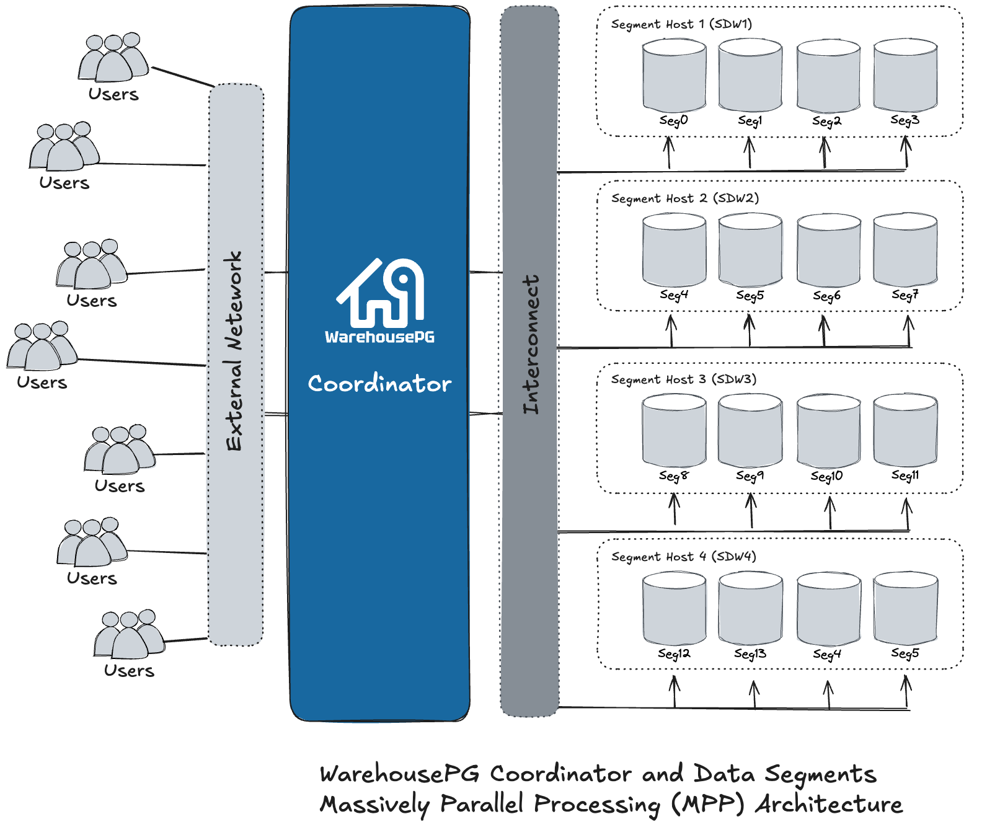

**WarehousePG** is an **open source**,  massively parallel processing (**MPP**) database server for **petabayte** scale analytic data warehouse and business intelligence workloads. 

WarehousePG is based on **PostgreSQL open-source technology**. It is essentially many **PostgreSQL** instances running in unison as one cohesive database management system (DBMS). Being **PostgreSQL** based, users may intereact with **WarehousePG** as they would a standard **PostgreSQL** instance, using familar third party tools and SQL support. 

**MPP** refers to clusters with two or more segment hosts working in parallel to deliver a query's result set.  User data is spread across the data segments using a distriubtion key.  In an **MPP** shared nothing environment, every segment hosts contains multiple segment instances (PostgreSQL processes) operating independently of other segments. Each segment hosts contains its own CPU, memory and storage.  User data is mirrored across the **WarehousePG** cluster delivering high availablity and fault tolerance.

## WarehousePG Architecture

## Documentation

[Release Notes](/docs/7x/release_notes/index.md)

[Install Guide](/docs/7x/install_guide/index.md)

[Admin Guide](/docs/7x/admin_guide/index.md)

[Best Practices](/docs/7x/best_practices/index.md)

[Utility Guide](/docs/7x/ref_guide/utility_guide/index.md)         

[Analytics Guide](/docs/7x/admin_guide/analytics/index.md)      

[Reference Guide](/docs/7x/ref_guide/index.md)        

[Security Guide](/docs/7x/security_guide/index.md)        

[Backup & Restore Guide](/docs/7x/admin_guide/backup_restore/index.md)
