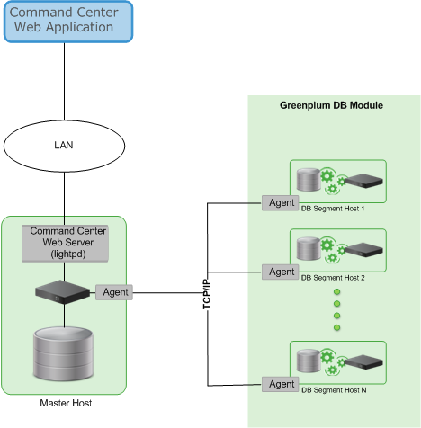

# About Management and Monitoring Utilities
---

WarehousePG Database provides standard command-line utilities for performing common monitoring and administration tasks.

WarehousePG command-line utilities are located in the $GPHOME/bin directory and are run on the coordinator host. WarehousePG provides utilities for the following administration tasks:

-   Installing WarehousePG Database on an array
-   Initializing WarehousePG
-   Starting and stopping WarehousePG Database
-   Adding or removing a host
-   Expanding the array and redistributing tables among new segments
-   Managing recovery for failed segment instances
-   Managing failover and recovery for a failed coordinator instance
-   Backing up and restoring a database \(in parallel\)
-   Loading data in parallel
-   Transferring data between WarehousePG databases
-   System state reporting

VMware provides an optional system monitoring and management tool, WarehousePG Command Center, which administrators can install and enable with WarehousePG Database. WarehousePG Command Center provides a web-based user interface for viewing system metrics and allows administrators to perform additional system management tasks. For more information about WarehousePG Command Center, see the [WarehousePG Command Center documentation](https://docs.vmware.com/en/VMware-WarehousePG-Command-Center/index.html).

**Parent topic:** [WarehousePG Database Concepts](../intro/concepts.html)

