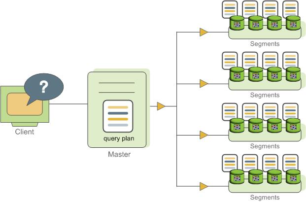
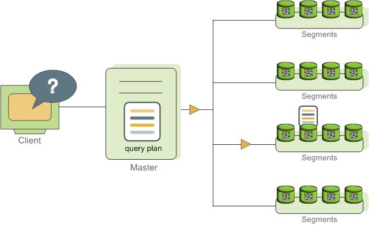
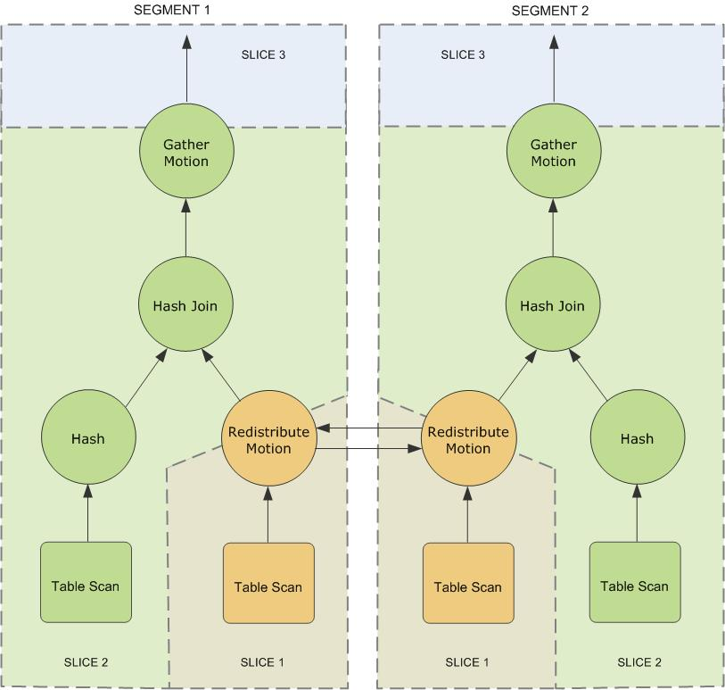
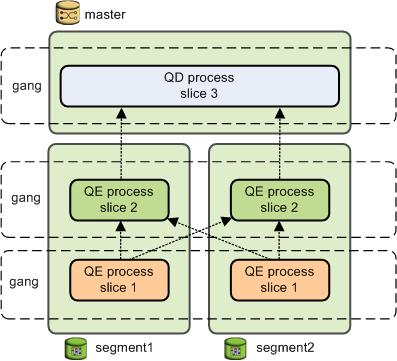

# About WarehousePG Query Processing
---

This topic provides an overview of how WarehousePG Database processes queries. Understanding this process can be useful when writing and tuning queries.

Users issue queries to WarehousePG Database as they would to any database management system. They connect to the database instance on the WarehousePG coordinator host using a client application such as `psql` and submit SQL statements.

**Parent topic:** [SQL: Querying Data](../../query/topics/query.html)

## <a id="topic2"></a>Understanding Query Planning and Dispatch

The coordinator receives, parses, and optimizes the query. The resulting query plan is either parallel or targeted. The coordinator dispatches parallel query plans to all segments. 



The coordinator dispatches targeted query plans to a single segment. Each segment is responsible for running local database operations on its own set of data. Most database operations—such as table scans, joins, aggregations, and sorts—run across all segments in parallel. Each operation is performed on a segment database independent of the data stored in the other segment databases.



Certain queries may access only data on a single segment, such as single-row `INSERT`, `UPDATE`, `DELETE`, or `SELECT` operations or queries that filter on the table distribution key column\(s\). In queries such as these, the query plan is not dispatched to all segments, but is targeted at the segment that contains the affected or relevant row\(s\).


## <a id="topic3"></a>Understanding WarehousePG Query Plans

A query plan is the set of operations WarehousePG Database will perform to produce the answer to a query. Each *node* or step in the plan represents a database operation such as a table scan, join, aggregation, or sort. Plans are read and run from bottom to top.

In addition to common database operations such as table scans, joins, and so on, WarehousePG Database has an additional operation type called *motion*. A motion operation involves moving tuples between the segments during query processing. Note that not every query requires a motion. For example, a targeted query plan does not require data to move across the interconnect.

To achieve maximum parallelism during query runtime, WarehousePG divides the work of the query plan into *slices*. A slice is a portion of the plan that segments can work on independently. A query plan is sliced wherever a *motion* operation occurs in the plan, with one slice on each side of the motion.

For example, consider the following simple query involving a join between two tables:

```
SELECT customer, amount
FROM sales JOIN customer USING (cust_id)
WHERE dateCol = '04-30-2016';

```

The following figure shows the query plan. Each segment receives a copy of the query plan and works on it in parallel.



The query plan for this example has a *redistribute motion* that moves tuples between the segments to complete the join. The redistribute motion is necessary because the customer table is distributed across the segments by `cust_id`, but the sales table is distributed across the segments by `sale_id`. To perform the join, the `sales` tuples must be redistributed by `cust_id`. The plan is sliced on either side of the redistribute motion, creating *slice 1* and *slice 2*.

This query plan has another type of motion operation called a *gather motion*. A gather motion is when the segments send results back up to the coordinator for presentation to the client. Because a query plan is always sliced wherever a motion occurs, this plan also has an implicit slice at the very top of the plan \(*slice 3*\). Not all query plans involve a gather motion. For example, a `CREATE TABLE x AS SELECT...` statement would not have a gather motion because tuples are sent to the newly created table, not to the coordinator.

## <a id="topic4"></a>Understanding Parallel Query Execution

WarehousePG creates a number of database processes to handle the work of a query. On the coordinator, the query worker process is called the *query dispatcher* \(QD\). The QD is responsible for creating and dispatching the query plan. It also accumulates and presents the final results. On the segments, a query worker process is called a *query executor* \(QE\). A QE is responsible for completing its portion of work and communicating its intermediate results to the other worker processes.

There is at least one worker process assigned to each *slice* of the query plan. A worker process works on its assigned portion of the query plan independently. During query runtime, each segment will have a number of processes working on the query in parallel.

Related processes that are working on the same slice of the query plan but on different segments are called *gangs*. As a portion of work is completed, tuples flow up the query plan from one gang of processes to the next. This inter-process communication between the segments is referred to as the *interconnect* component of WarehousePG Database.

The following figure shows the query worker processes on the coordinator and two segment instances for previous query plan.



