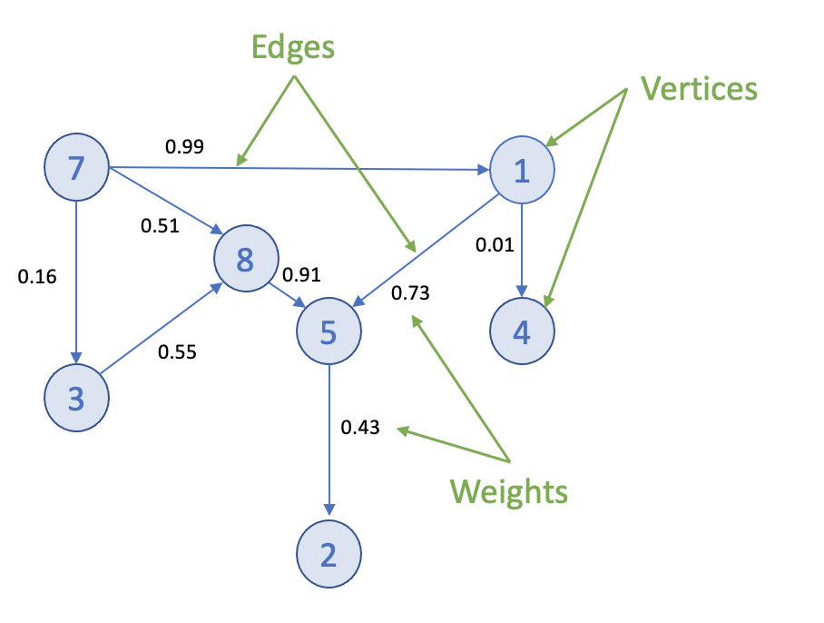
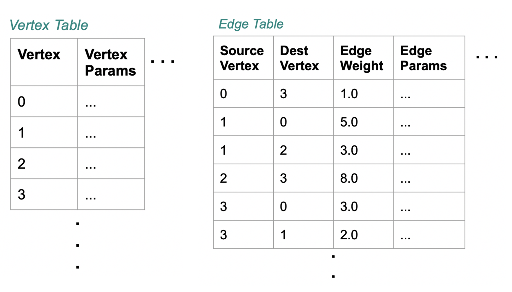

# Graph Analytics
---

Many modern business problems involve connections and relationships between entities, and are not solely based on discrete data. Graphs are powerful at representing complex interconnections, and graph data modeling is very effective and flexible when the number and depth of relationships increase exponentially.

The use cases for graph analytics are diverse: social networks, transportation routes, autonomous vehicles, cyber security, criminal networks, fraud detection, health research, epidemiology, and so forth.

This chapter contains the following information:

-   [What is a Graph?](#topic_graph)
-   [Graph Analytics on WarehousePG](#graph_on_greenplum)
-   [Using Graph](#topic_using_graph)
-   [Graph Modules](#topic_graph_modules)
-   [References](#topic_graph_references)

## <a id="topic_graph"></a>What is a Graph?

Graphs represent the interconnections between objects \(vertices\) and their relationships \(edges\). Example objects could be people, locations, cities, computers, or components on a circuit board. Example connections could be roads, circuits, cables, or interpersonal relationships. Edges can have directions and weights, for example the distance between towns.



Graphs can be small and easily traversed - as with a small group of friends - or extremely large and complex, similar to contacts in a modern-day social network.

## <a id="graph_on_greenplum"></a>Graph Analytics on WarehousePG

Efficient processing of very large graphs can be challenging. WarehousePG offers a suitable environment for this work for these key reasons:

1.  Using MADlib graph functions in WarehousePG brings the graph computation close to where the data lives. Otherwise, large data sets need to be moved to a specialized graph database, requiring additional time and resources.
2.  Specialized graph databases frequently use purpose-built languages. With WarehousePG, you can invoke graph functions using the familiar SQL interface. For example, for the [PageRank](http://madlib.apache.org/docs/latest/group__grp__pagerank.html) graph algorithm:

    ```
    SELECT madlib.pagerank('vertex',     -- Vertex table
                   'id',                 -- Vertex id column
                   'edge',               -- Edge table
                   'src=src, dest=dest', -- Comma delimited string of edge arguments
                   'pagerank_out',       -- Output table of PageRank
                    0.5);                -- Damping factor
    SELECT * FROM pagerank_out ORDER BY pagerank DESC;
    ```

3.  A lot of data science problems are solved using a combination of models, with graphs being just one. Regression, clustering, and other methods available in WarehousePG, make for a powerful combination.
4.  WarehousePG offers great benefits of scale, taking advantage of years of query execution and optimization research focused on large data sets.

## <a id="topic_using_graph"></a>Using Graph

**Installing Graph Modules**

To use the MADlib graph modules, install the version of MADlib corresponding to your WarehousePG Database version. To download the software, access the VMware Tanzu Network. For WarehousePG 6.x, see [Installing MADlib](./madlib.html#topic3).

Graph modules on MADlib support many algorithms.

**Creating a Graph in WarehousePG**

To represent a graph in WarehousePG, create tables that represent the vertices, edges, and their properties.



Using SQL, create the relevant tables in the database you want to use. This example uses `testdb`:

```
gpadmin@cdw ~]$ psql
dev=# \c testdb
```

Create a table for vertices, called `vertex`, and a table for edges and their weights, called `edge`:

```
testdb=# DROP TABLE IF EXISTS vertex, edge; 
testdb=# CREATE TABLE vertex(id INTEGER); 
testdb=# CREATE TABLE edge(         
         src INTEGER,        
         dest INTEGER,           
         weight FLOAT8        
         );
```

Insert values related to your specific use case. For example :

```
testdb#=> INSERT INTO vertex VALUES
(0),
(1),
(2),
(3),
(4),
(5),
(6),
(7); 

testdb#=> INSERT INTO edge VALUES
(0, 1, 1.0),
(0, 2, 1.0),
(0, 4, 10.0),
(1, 2, 2.0),
(1, 3, 10.0),
(2, 3, 1.0),
(2, 5, 1.0),
(2, 6, 3.0),
(3, 0, 1.0),
(4, 0, -2.0),
(5, 6, 1.0),
(6, 7, 1.0);
```

Now select the [Graph Module](#topic_graph_modules) that suits your analysis.

## <a id="topic_graph_modules"></a>Graph Modules

This section lists the graph functions supported in MADlib. They include: [All Pairs Shortest Path \(APSP\)](#section_m2x_rkr_xlb), [Breadth-First Search](#section_ykg_53s_xlb), [Hyperlink-Induced Topic Search \(HITS\)](#section_evh_t3s_xlb), [PageRank and Personalized PageRank](#section_e3f_s3s_xlb), [Single Source Shortest Path \(SSSP\)](#section_rxc_r3s_xlb), [Weakly Connected Components](#section_zmd_q3s_xlb), and [Measures](#section_wcn_w3s_xlb). Explore each algorithm using the example `edge` and `vertex` tables already created.

### <a id="section_m2x_rkr_xlb"></a>All Pairs Shortest Path \(APSP\)

The all pairs shortest paths \(APSP\) algorithm finds the length \(summed weights\) of the shortest paths between all pairs of vertices, such that the sum of the weights of the path edges is minimized.

The function is:

```
graph_apsp( vertex_table,
vertex_id,
edge_table,            
edge_args,            
out_table,            
grouping_cols          
)
```

For details on the parameters, with examples, see the [All Pairs Shortest Path](http://madlib.apache.org/docs/latest/group__grp__apsp.html) in the Apache MADlib documentation.

### <a id="section_ykg_53s_xlb"></a>Breadth-First Search

Given a graph and a source vertex, the breadth-first search \(BFS\) algorithm finds all nodes reachable from the source vertex by searching / traversing the graph in a breadth-first manner.

The function is:

```
graph_bfs( vertex_table,
          vertex_id,           
          edge_table,           
          edge_args,           
          source_vertex,           
          out_table,           
          max_distance,           
          directed,
          grouping_cols
          )
```

For details on the parameters, with examples, see the [Breadth-First Search](http://madlib.apache.org/docs/latest/group__grp__bfs.html) in the Apache MADlib documentation.

### <a id="section_evh_t3s_xlb"></a>Hyperlink-Induced Topic Search \(HITS\)

The all pairs shortest paths \(APSP\) algorithm finds the length \(summed weights\) of the shortest paths between all pairs of vertices, such that the sum of the weights of the path edges is minimized.

The function is:

```
graph_apsp( vertex_table,
           vertex_id,
           edge_table,            
           edge_args,            
           out_table,            
           grouping_cols          
           )
```

For details on the parameters, with examples, see the [Hyperlink-Induced Topic Search](http://madlib.apache.org/docs/latest/group__grp__hits.html) in the Apache MADlib documentation.

### <a id="section_e3f_s3s_xlb"></a>PageRank and Personalized PageRank

Given a graph, the PageRank algorithm outputs a probability distribution representing a person’s likelihood to arrive at any particular vertex while randomly traversing the graph.

MADlib graph also includes a personalized PageRank, where a notion of importance provides personalization to a query. For example, importance scores can be biased according to a specified set of graph vertices that are of interest or special in some way.

The function is:

```
pagerank( vertex_table,
          vertex_id,          
          edge_table,          
          edge_args,          
          out_table,          
          damping_factor,          
          max_iter,          
          threshold,          
          grouping_cols,          
          personalization_vertices         
          )
```

For details on the parameters, with examples, see the [PageRank](http://madlib.apache.org/docs/latest/group__grp__pagerank.html) in the Apache MADlib documentation.

### <a id="section_rxc_r3s_xlb"></a>Single Source Shortest Path \(SSSP\)

Given a graph and a source vertex, the single source shortest path \(SSSP\) algorithm finds a path from the source vertex to every other vertex in the graph, such that the sum of the weights of the path edges is minimized.

The function is:

```
graph_sssp ( vertex_table, 
vertex_id, 
edge_table, 
edge_args, 
source_vertex, 
out_table, 
grouping_cols 
)
```

For details on the parameters, with examples, see the [Single Source Shortest Path](http://madlib.apache.org/docs/latest/group__grp__sssp.html) in the Apache MADlib documentation.

### <a id="section_zmd_q3s_xlb"></a>Weakly Connected Components

Given a directed graph, a weakly connected component \(WCC\) is a subgraph of the original graph where all vertices are connected to each other by some path, ignoring the direction of edges.

The function is:

```
weakly_connected_components( 
vertex_table, 
vertex_id, 
edge_table, 
edge_args, 
out_table, 
grouping_cols 
)
```

For details on the parameters, with examples, see the [Weakly Connected Components](http://madlib.apache.org/docs/latest/group__grp__wcc.html) in the Apache MADlib documentation.

### <a id="section_wcn_w3s_xlb"></a>*Measures*

These algorithms relate to metrics computed on a graph and include: [Average Path Length](#section_k4q_x3s_xlb), [Closeness Centrality](#section_a2q_y3s_xlb) , [Graph Diameter](#section_pft_k4s_xlb), and [In-Out Degree](#section_srk_j4s_xlb).

### <a id="section_k4q_x3s_xlb"></a>Average Path Length

This function computes the shortest path average between pairs of vertices. Average path length is based on "reachable target vertices", so it averages the path lengths in each connected component and ignores infinite-length paths between unconnected vertices. If the user requires the average path length of a particular component, the weakly connected components function may be used to isolate the relevant vertices.

The function is:

```
graph_avg_path_length( apsp_table,
                       output_table 
                       )
```

This function uses a previously run APSP \(All Pairs Shortest Path\) output. For details on the parameters, with examples, see the [Average Path Length](http://madlib.apache.org/docs/latest/group__grp__graph__avg__path__length.html) in the Apache MADlib documentation.

### <a id="section_a2q_y3s_xlb"></a>Closeness Centrality

The closeness centrality algorithm helps quantify how much information passes through a given vertex. The function returns various closeness centrality measures and the k-degree for a given subset of vertices.

The function is:

```
graph_closeness( apsp_table,
output_table, 
vertex_filter_expr 
)
```

This function uses a previously run APSP \(All Pairs Shortest Path\) output. For details on the parameters, with examples, see the [Closeness](http://madlib.apache.org/docs/latest/group__grp__graph__closeness.html) in the Apache MADlib documentation.

### <a id="section_pft_k4s_xlb"></a>Graph Diameter

Graph diameter is defined as the longest of all shortest paths in a graph. The function is:

```
graph_diameter( apsp_table, 
output_table 
)
```

This function uses a previously run APSP \(All Pairs Shortest Path\) output. For details on the parameters, with examples, see the [Graph Diameter](http://madlib.apache.org/docs/latest/group__grp__graph__diameter.html) in the Apache MADlib documentation.

### <a id="section_srk_j4s_xlb"></a>In-Out Degree

This function computes the degree of each node. The node degree is the number of edges adjacent to that node. The node in-degree is the number of edges pointing in to the node and node out-degree is the number of edges pointing out of the node.

The function is:

```
graph_vertex_degrees( vertex_table,
vertex_id,    
edge_table,
edge_args,    
out_table,
grouping_cols
)
```

For details on the parameters, with examples, see the [In-out Degree](http://madlib.apache.org/docs/latest/group__grp__graph__vertex__degrees.html) page in the Apache MADlib documentation.

## <a id="topic_graph_references"></a>References

MADlib on WarehousePG is at [Machine Learning and Deep Learning using MADlib](madlib.html).

MADlib Apache web site and MADlib release notes are at [http://madlib.apache.org/](http://madlib.apache.org/).

MADlib user documentation is at [http://madlib.apache.org/documentation.html](http://madlib.apache.org/documentation.html).

